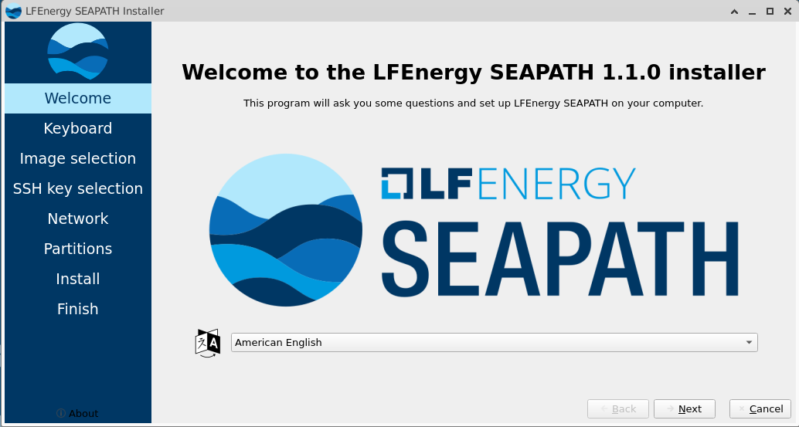

<!--Copyright (C) 2025 Savoir-faire Linux, Inc.
SPDX-License-Identifier: GPL-3.0-or-later -->

# seapath-installer

> A customized installer for SEAPATH based on Calamares framework.





seapath-installer is the universal installer solution to install
SEAPATH (Debian & Yocto) on a target machine.

> **NOTE:**  This project only concerns the installer application. It
> does not generate the live OS installer. See [seapath-live-installer](https://github.com/seapath/seapath-live-installer)

## Fork Information

This project is a fork of [Calamares](https://codeberg.org/Calamares/calamares),
a distribution-independent system installer framework.

**Upstream**: https://codeberg.org/Calamares/calamares

## SEAPATH-Specific Features

- Custom SEAPATH image selection module
- SSH key configuration
- Network configuration
- Custom raw image installation module powered by bmaptools
- SEAPATH image partition layout preview


## Installation

### Prerequisites

seapath-installer is already configured to build Calamares in a Docker
container using [cqfd](https://github.com/savoirfairelinux/cqfd), and
we strongly recommend using it to build the installer.

Make sure your localhost system complies with the following
dependencies:

```
docker
```

Install `cqfd`:
```
git clone https://github.com/savoirfairelinux/cqfd.git
cd cqfd
sudo make install
```

If you wish to build seapath-installer without Docker (again, not
recommended), make sure the dependencies listed in `.cqfd/Dockerfile`
are installed on your system (Debian 12).

> **NOTE:** seapath-installer is currently only supported using QT5 platform.

## Getting Started
### Building seapath-installer

To build seapath-installer using `cqfd`, first generate the cqfd image:

```
cqfd init
```

Then, build the installer:

```
cqfd
```

To build outside of cqfd, run:
```
./build.sh
```

If everything went well, a `.deb` package will be created in the root
directory of the project.

> **NOTE:** `seapath-installer` is currently only supported on Debian 12
> systems using QT5 platform.

### Installing seapath-installer

To install seapath-installer, first copy the generated `.deb` package to
the target machine, then run:

```
sudo apt install ./seapath-installer-<version>.deb
```

### Running seapath-installer

To run seapath-installer, execute the following command in a terminal:

```sudo calamares```

To enable debug logging, run:

```sudo calamares -d```

### seapath-installer artifacts

seapath-installer expects the installation artifacts (SEAPATH images,
SSH keys, etc), to be located in a directory mounted at `/seapath` with
the following structure:

```
/seapath
├── images
│   ├── seapath-debian-<version>.raw.gz
│   └── seapath-v1.1.0-observer-efi-image.rootfs.wic.gz
└── ssh-keys
    └── ssh_key1.pub
    └── ssh_key2.pub
```

Where:
- `images/` contains the SEAPATH images to install
- `ssh-keys/` contains the SSH public keys to add to the installed system

seapath-installer is designed to install any kind of rootfs raw image, as long
the extension are `raw.gz` or `wic.gz`. SSH keys must be valid public
key files.


### SEAPATH target configuration

By default, the following configurations are installed on the installed SEAPATH
system:

- Keyboard layout
- SEAPATH images
- SSH Keys: will be append to the `~/.ssh/authorized_keys` file of
the `admin` and `ansible` users on the installed system.
- Network configuration: DHCP/static IP configuration for the selected
  interface.
> **NOTE:**: The configured network interface is only the management
> interface used to connect to the SEAPATH machine by Ansible and the
> `admin` user.
- Partition: installed partition layout depends on the selected SEAPATH
  image. It cannot be modified by the user.
> **NOTE:**: On SEAPATH Yocto, the persistent partition is extended to
> the maximum free space available on the target device.

## Contributing

See
[CONTRIBUTING.md](https://github.com/seapath/.github/blob/main/CONTRIBUTING.md)
for details.
On this project, each PR is automatically checked by a CI pipeline.

## License

This project maintains the original Calamares licenses. See
[LICENSES](./LICENSES) directory.

## Calamares

For more information about the upstream Calamares project, visit
https://calamares.euroquis.nl/

# Release notes
## Version 1.2.1
* Fix segfault when no partitions are on the selected disk
* Fix error when multiple lvm volume group are present on the machine

## Version 1.2.0
* Fix slideshow image display
* Add bmap support for SEAPATH Debian images
* Use the finishedq module instead the finished module

## Version 1.1.0
Initial release
